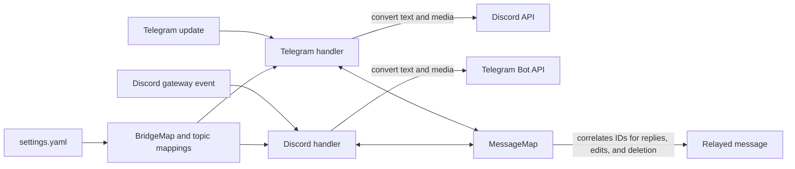

# Architecture and message flow

TediCross runs one Telegram bot client and one Discord gateway client. A `BridgeMap` routes each incoming update to the configured bridge or topic mapping. Platform-specific handlers convert message text and supported media, then send through the other platform's API.

The in-memory `MessageMap` correlates source messages with their relayed messages for replies, edits, and supported cross-deletion. Set `persistentMessageMap: true` to store these mappings in SQLite in the configured data directory and retain them across restarts. The map expires entries after `messageTimeoutAmount` and `messageTimeoutUnit` when persistence is disabled.

The source is divided into `src/telegram2discord/` and `src/discord2telegram/` handlers, with shared bridge/configuration types in `src/bridgestuff/` and `src/settings/`. The application entry point and clients are in `src/main.ts`.
